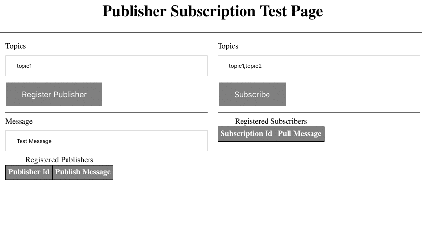

# mypubsub

## Run Server 

```
./gradlew clean build && java -jar build/libs/mypubsub-0.1.0.jar
```

## Usage
The following UI can be used for testing the UI
http://localhost:8080/

* Provide comma separated topic names and register a publisher.
* Provide comma separated topic names and register a subscriber.
* Use the publisher id (type 4 UUID) to publish  message.
* Use the subscriber id (type 4 UUID) to pull messages.
* If there are any pending messages in subscription which are not pulled yet and server stopped,
  the messages can be pulled again when server is started again using the subscription id.
* The server uses the local filesystem "data" directory to persist the messages in the subscription.
* Files in the "data" can be removed to reset all subscription data.

## Register Publisher
Registers the publisher with one one more topics.

```
curl -H "Content-type: application/json" -X POST -d '<Array of Topics>' localhost:8080/registerPublisher

e.g. curl -H "Content-type: application/json" -X POST -d '["topic1","topic2"]' localhost:8080/registerPublisher
```

Returns a publisher_id in response

## Subscribe to Topics
Subscribes to one more topics for messages.

```
curl -H "Content-type: application/json" -X POST -d '<Array of Topics>' localhost:8080/subscribe

e.g. curl -H "Content-type: application/json" -X POST -d '["topic1","topic2"]' localhost:8080/subscribe
```
Returns a subscription_id in response


## Publish Message

Given a registered id, publishes messages to to the topics the publishers registered with.
```
curl -X POST -d '<message>' localhost:8080/<publisher_id>/publish

e.g. curl -X POST -d 'msg2' localhost:8080/b0c915f6-b45d-454d-9da6-ec70442d246c/publish
```

## Pull messages from subscription 
Given a valid subscription id pulls messages from the topc it has subscribed to.
Note only the messages arrived after it has subscribed to the topics would be received.

```
curl localhost:8080/<Subscription_id>/pull

e.g. 
curl localhost:8080/b0c915f6-b45d-454d-9da6-ec70442d246c/pull
```



## TODO
1. Push overflowing pending messages to persistence.
2. Concurrrency tests.
3. Push subscriptions.
 